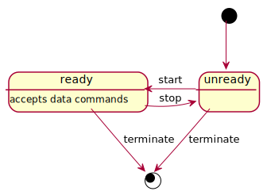

# Backend Python/Linux Systems Hiring Challenge

# Introduction

Datapane is an API-driven product for building analytics reports in Python - part of this includes running user's Python scripts and controlling their execution from a central server. This project simulates some of the necessary tasks required in developing such a system.

# Task

For this task we'll be building a small distributed system, consisting of a server and client, both in Python, that can communicate uni-directionally to send structured data and commands.

The system must run on Linux, and can make use of any distributed technologies of your choice, for instance for IPC you could look at HTTP, gRPC, zeromq, redis, unix sockets, etc. and for data marshalling you could look at JSON, protobufs, pickle, msgpack, XML, or anything else.

## Server

The server simply loops taking input from the user via the terminal, and sending commands to the running client.

## Client

The client should listen for commands form the server and act upon them - it should always be able to accept new messages.

## Commands

The client must support the following commands that can be sent by the server - the server may send multiple commands and the client should accept these.

### Control commands
 - `start()` - move to `ready` state to start accepting data commands
 - `stop()` - move to `unready` state and stop accepting data commands
 - `terminate()` - immediately stop and exit cleanly, preferably cleaning up any resources first

### Data commands

These can only be executed when the client is in the `ready` state

 - `ping() -> int` - return the current unix timestamp
 - `calculate(x: float, msg: str)` - simulate a long-running computation that takes `x` seconds to run and prints `msg` upon completion

The following state diagram describes the control commands and how they affect the client state,

## Technologies

- Build systems, tools, and scripts of your choice, e.g. poetry, `setup.py`, docker, etc.
- The system must run on Linux and be presented as a set of Docker containers that run using docker-compose.
- Any libraries you may find useful to help your task, we prioritise using existing libraries to accomplish tasks rather than building in-house and/or writing custom code that wouldn't scale to larger use-cases

## Requirements

- You do not need to worry about client/server service discovery - the locations of the systems can be hard-coded, provided as env vars, command-line parameters, etc.
- Instructions should be provided on how to build / bundle / start the system
- You should aim to use the latest Python language features, ecosystem, tooling, and libraries where possible

### Optional Features

- Messages may be untrusted, you should consider how you can defend against that
- Consider how you would implement bi-directional communication, such that the client could send messages to the server
- Tests

# Review

Please don't spend more than 2-4 hours on this - we're looking to see how you approached the problem and the decisions made rather than a complete solution. This should be a fun challenge rather than a stressful endeavour.

There is no right answer as such, we will mainly be looking at code quality, software architecture skills, completeness of the solution from a software engineering perspective, and clarity of thought.

Once completed, please create a PR containing your work, send us an email, and schedule a [second follow-up interview](https://calendar.google.com/calendar/selfsched?sstoken=UU1sbG9QV1hfcHlGfGRlZmF1bHR8ODI1ZjRlZWJlZTY0ZTQ1ZTI4MzNkZThhOGQ5MjZkNzg).

